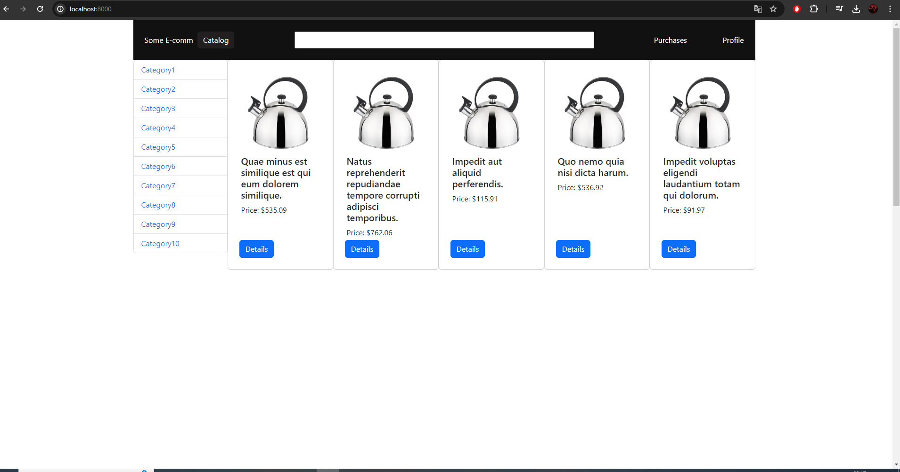
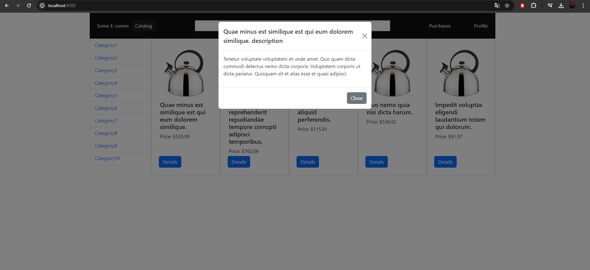
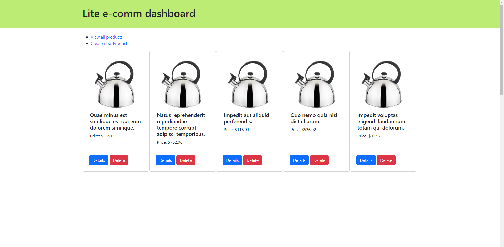
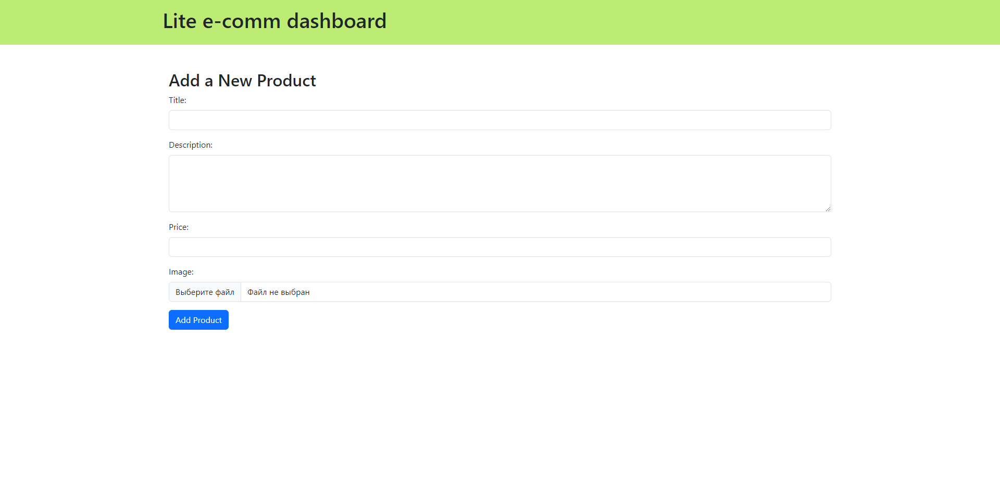

# PHP Fullstack Test Task

## Used Technologies
- Laravel
- Bootstrap

## Used Laravel Features
- Controllers
- Requests (Validation)
- Models
- Factories
- Migrations
- Storage (File System)
- Feature Testing

## Screenshots

### Results Page

### Modal Example

### Dashboard View

### Create New Product Form
